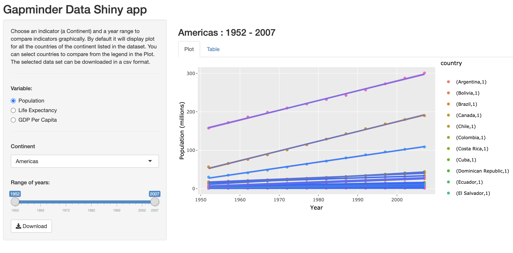
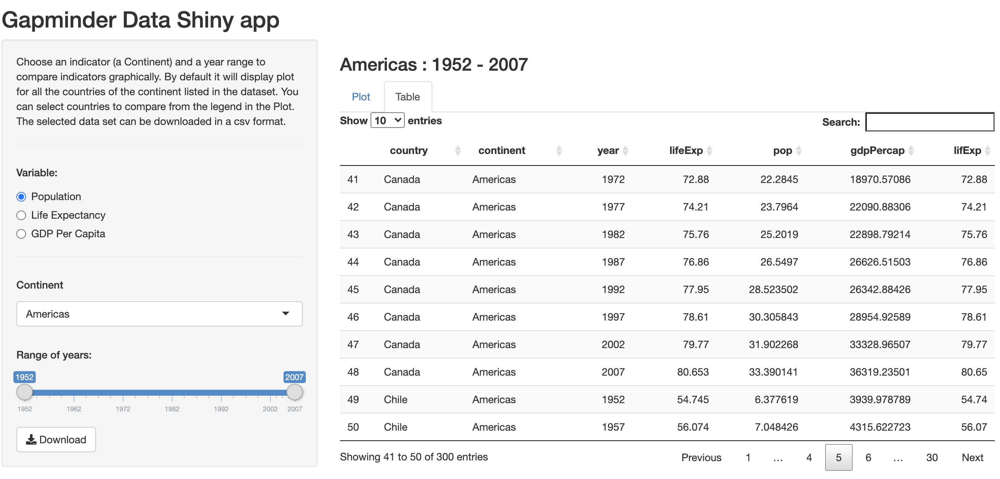

```{r setup, include=FALSE}
knitr::opts_chunk$set(echo = FALSE)
```

## Gapminder Data

- Gapminder combines data from multiple sources into unique coherent time-series that can't be found elsewhere. These data are available for download [here](https://www.gapminder.org/data/documentation/#:~:text=Gapminder%20combines%20data%20from%20multiple,the%20sources%20in%20each%20case.) 
- Alternative to downloading data is to use gapminder package in R. 
- Gapminder library was used for this app.
- This app focus is on the three indicators Population, Life Expectancy, and GDP Per Capita from the year 1952 to 2007 in five continents.
- The **Plot** tab, the selected indicator vs year will be plotted. 
- The **Table** tab displays the table of data for the selected continent. 


Here is a [link]( https://shovitraj.shinyapps.io/Gapminder_Continent/) to my Gapminder data Shinyapp. 

## Sample Code
```{r , echo=TRUE,message=FALSE,warning=FALSE, eval=FALSE, comment= " "}
library(ggplot2);library(gapminder);library(plotly)
lifeexp<-gapminder %>%
        group_by(continent, year) %>%
        filter(continent == 'Oceania') 
g1<- ggplot(lifeexp, aes(x=year, y=lifeExp, color=country)) +
        geom_point(aes(color=country)) +
        geom_smooth(aes(fill= country), method="lm", formula= y~x) +
        xlab("Year") +
        ylab("Life Expectancy (years)")
p1 <- ggplotly(g1)
p1
```


## Sample Plot
```{r , echo=FALSE,message=FALSE,warning=FALSE, eval=TRUE}
library(ggplot2);library(gapminder);library(plotly)
GDP<-gapminder %>%
        group_by(continent, year) %>%
        filter(continent == 'Oceania') 

g2<- ggplot(GDP, aes(x=year, y=gdpPercap, color=country)) +
        geom_point(aes(color=country)) +
        geom_smooth(aes(fill= country), method="lm", formula= y~x) +
        xlab("Year") +
        ylab("GDP Per Capita, PPP (fixed 2005 international $)")
p2 <- ggplotly(g2)
p2
```


## Overview of an app
<center>
{width=40%}
{width=40%}

</center>

[Gapminder information](https://https://www.gapminder.org/)
[Shinyapp](https://shovitraj.shinyapps.io/Gapminder_Continent/)
File: [ui.R](ui.R)
File: [server.R](server.R) 

<center>
**Thank you for taking your time to go over my slides.**
</center>


